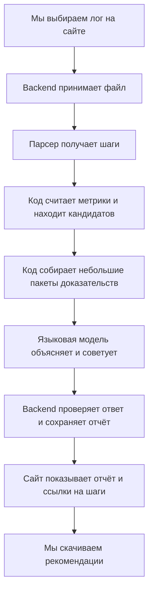

# Что мы делаем и зачем: объяснение для нашей команды

Мы делаем сайт, который разбирает историю работы кодинг-агента и помогает нам понять: **где агент ходил по кругу, на чём терял ресурсы и какие инструкции помогут избежать этого в следующий раз**.

Этот файл читаем первым. Технические подробности, структура проекта, API и промпт находятся в [плане архитектуры](02-architecture-and-ml.md).

Документы описывают наше предлагаемое решение. Backend, детекторы и ML уже объединены; запуск описан в [README](../README.md). Интерфейс сайта ещё не реализован. Основа — PDF «Кейс 2. Что наделал агент», страницы 2–11. Примеры ниже учебные: на защите мы должны показывать настоящую сессию.

## 1. В чём вообще проблема

Мы просим агента: «Почини тесты». Он что-то читает, запускает команды, меняет файлы, снова запускает команды. Через некоторое время задача закончена или агент застрял.

По итоговому ответу трудно понять, насколько хорошо он работал. Возможно, он пять раз повторил неработающую команду. Возможно, исправил файл, потом вернул всё обратно. Возможно, ему несколько раз пришлось объяснять одно и то же.

В истории это есть, но вручную разбирать сотни шагов долго. Даже если мы нашли ошибку поведения, нужно ещё превратить вывод в полезное правило. Иначе на следующей задаче всё повторится.

Мы хотим замкнуть эту цепочку:

```text
Агент поработал → сохранилась история → мы нашли проблемные места
→ получили понятные рекомендации → добавили нужные правила в проект
→ проверили их пользу в следующей сессии.
```

Последнее сравнение — возможное развитие продукта. Для первой версии достаточно качественно разобрать одну сессию и подготовить рекомендации.

## 2. Кто такой агент и что такое лог

**Кодинг-агент** — программа вроде Claude Code или Codex, которая получает задачу, обращается к языковой модели и использует инструменты: читает файлы, запускает тесты, редактирует код.

**Сессия** — один сохранённый разговор и связанные с ним действия. В сессии может быть несколько сообщений человека и много действий агента.

**Лог** — журнал этих сообщений и действий. Это файл с данными, а не запись экрана. В нём могут быть команда, её аргументы, результат, ошибка, время, модель и сведения о токенах. Полнота зависит от формата и версии клиента.

**JSONL** — текстовый файл, в котором каждая строка содержит отдельную JSON-запись. Одна такая запись может содержать несколько действий. Поэтому «строка файла» и «шаг на нашем сайте» — не всегда одно и то же.

**Токены** — небольшие части текста, которыми модель считает вход и выход. Число токенов помогает оценивать расход, но само по себе не доказывает бесполезность работы.

## 3. Пример на пальцах

Представим такую историю:

```text
Шаг 1. Мы: «Запусти тесты и исправь ошибку».
Шаг 2. Агент запускает npm test.
Шаг 3. Инструмент отвечает: Missing script: test.
Шаг 4. Агент снова запускает npm test.
Шаг 5. Получает ту же ошибку.
Шаг 6. Агент в третий раз запускает npm test.
Шаг 7. Получает ту же ошибку.
Шаг 8. Мы: «Сначала посмотри scripts в package.json».
Шаг 9. Агент читает package.json и находит test:unit.
Шаг 10. Агент запускает npm run test:unit.
```

Что должен показать наш сервис:

- **Факт:** на шагах 2, 4 и 6 повторяется одна команда, и все три результата содержат одинаковую ошибку.
- **Объяснение:** вероятно, агент повторял действие без проверки доступных команд проекта. Это предположение о причине, а не чтение мыслей агента.
- **Доказательство:** можно открыть сами шаги и увидеть команды и результаты.
- **Рекомендация:** перед запуском тестов проверить scripts в package.json; после повторения одинаковой ошибки сначала выяснить причину.
- **Готовый текст правила:** его можно скачать и добавить в инструкции проекта.

Мы не пишем «агент потратил ровно 3 доллара впустую», если лог этого не подтверждает. Даже токены на этом участке не обязательно все потрачены впустую.

## 4. Что от нас обязательно хотят в кейсе

По условиям кейса мы должны:

1. Принять лог настоящей рабочей сессии Claude Code **или** Codex. Достаточно выбрать один формат.
2. Посчитать часть метрик обычным кодом.
3. Привязать находки к конкретным шагам, чтобы человек мог проверить вывод.
4. Объяснить проблемы и дать конкретные рекомендации на следующую сессию.
5. Справиться с незнакомым логом выбранного формата, пропусками полей и оборванным файлом.
6. Продумать большие логи, которые нельзя целиком отправлять модели.
7. Показать работающий сервис вживую, подготовить пример разбора и питч.

В кейсе перечислены направления поиска: повторы инструментов, ошибки и повторные попытки, токены по участкам, вмешательства человека, отменённые правки и интервалы между шагами.

**Сайт — наш способ показать решение.** По PDF сам веб-интерфейс не обязателен и сам по себе баллов за содержание не даёт. Мы всё равно делаем сайт, потому что на нём удобно загрузить файл и проверить находку.

## 5. Что конкретно мы делаем в первой версии

Выбираем **Claude Code JSONL** как первый формат. Это наше техническое решение, а не требование организаторов. Его нужно рано проверить на нескольких настоящих файлах.

На сайте будет такой сценарий:

1. Мы выбираем файл лога на компьютере.
2. Сайт загружает файл на наш сервер.
3. Сервер разбирает записи и считает факты.
4. Сервер отправляет модели небольшие отобранные фрагменты с фактами.
5. Модель возвращает объяснения и рекомендации.
6. Сервер проверяет ответ и сохраняет отчёт.
7. Сайт показывает находки, доказательства и кнопку скачивания рекомендаций.

Визуальное оформление делает наш дизайнер. Здесь мы договариваемся о содержании и поведении.

## 6. Из каких частей состоит наш сайт

### Frontend: то, что открыто в браузере

Делаем его на React + TypeScript. Он показывает форму загрузки, состояние обработки, отчёт и шаги лога. Сам анализ он не выполняет.

### Backend: наш сервер

Делаем его на Python + FastAPI. Он принимает файл, запускает разбор, обращается к модели и отдаёт результат браузеру.

### Парсер: переводчик файла

Парсер — обычный Python-код. Он превращает разные записи Claude Code в понятные нам объекты: «сообщение человека», «вызов инструмента», «ответ инструмента».

### Анализатор: счётчик и поиск признаков проблем

Тоже обычный код. Он считает вызовы, ошибки, повторения и доступные токены. Например, обнаруживает три одинаковые команды с одинаковым результатом.

### Языковая модель: объяснение контекста

Она получает найденные факты и окружающие шаги. Её задача — объяснить, насколько подозрителен эпизод, и предложить полезное изменение инструкций.

### Хранилище: память нашего сервиса

В SQLite храним шаги, состояния обработки и отчёты. Загруженные файлы лежат в отдельной папке сервера. SQLite — база в одном файле; для одного демонстрационного сервера этого достаточно.



## 7. ML-часть совсем простыми словами

### Мы обучаем свою нейросеть?

Нет. Для первой версии берём уже готовую языковую модель. Нам не нужен обучающий датасет, обучение на GPU или отдельный исследовательский проект.

ML в нашем решении — это **использование готовой модели для объяснения найденных событий**. Основная работа команды: правильно прочитать лог, найти факты и проверить, что модель не выдумала выводы.

### Какую модель берём?

Наш начальный вариант — **GPT-4.1 mini через OpenAI API**, с зафиксированным именем `gpt-4.1-mini-2025-04-14`. У неё есть поддержка структурированного ответа, то есть данных в заранее заданной форме. Это удобная отправная точка, а не утверждение, что она лучшая для этого кейса. [Документация модели](https://developers.openai.com/api/docs/models/gpt-4.1-mini).

В начале разработки проверяем доступ к API из среды развёртывания, ключ, оплату и качество на наших логах. Доступ команды пока не подтверждён. Если организаторы дают другой доступный API, меняем модуль подключения модели и повторно проверяем качество. Остальные части сайта остаются такими же.

Модель, **которая выполняла исходную задачу**, и модель, **которая разбирает её историю**, — разные роли. Лог Claude Code можно разбирать другой моделью.

### Откуда берётся запрос к модели?

Его составляет наш backend. Пользователь не обязан писать отдельный запрос.

Backend берёт:

- наш постоянный промпт с правилами анализа;
- исходную задачу человека, если она есть в логе;
- факты, которые уже посчитал код;
- несколько шагов до и после подозрительного места;
- идентификаторы шагов, на которые разрешено ссылаться.

Из этого получается запрос: «Вот три одинаковые неудачные попытки и их контекст. Объясни эпизод и предложи правило, которое поможет его избежать».

### Есть ли у модели промпт и где он лежит?

Да. Планируем файл `backend/app/llm/prompts/explain_findings.md` в репозитории. Промпт — это текст наших инструкций для модели.

По смыслу там написано:

> Объясняй только переданные факты. Ссылайся на существующие шаги. Не придумывай стоимость и время. Отличай наблюдение от предположения. Предлагай конкретное действие. Если данных недостаточно, так и скажи.

Полный вариант есть в [техническом документе](02-architecture-and-ml.md).

### Куда именно уходит запрос?

```text
Браузер → наш backend → API модели в интернете
                          ↓
Браузер ← наш backend ← ответ модели
```

Ключ API хранится на сервере. В браузер и репозиторий он не попадает. Сам файл лога автоматически не становится доступным модели: она видит только данные, которые backend включил в конкретный запрос.

### Что модель возвращает?

Она возвращает структурированный JSON — объект с полями. В упрощённом виде:

```json
{
  "candidate_id": "candidate-1",
  "evidence_step_ids": ["step-2", "step-3", "step-4", "step-5", "step-6", "step-7"],
  "explanation": "Вероятно, агент повторял команду без проверки доступного скрипта.",
  "recommendation": "До запуска тестов проверь scripts в package.json."
}
```

Это иллюстрация; точный контракт описан в архитектуре. Модель не рисует страницу, не создаёт записи в нашей базе и не меняет проект пользователя. Всё это контролирует backend.

### Как ответ появляется на сайте?

Backend проверяет структуру ответа и ссылки на шаги, добавляет рассчитанные кодом метрики и сохраняет отчёт. Frontend получает его через наш API и показывает поля в интерфейсе, который спроектирует дизайнер.

### Зачем нужен обычный код, если есть модель?

Потому что количество ошибок можно посчитать точно, а объяснение причин требует контекста. Нам нужен проверяемый разбор: числа из кода, объяснения из модели, доказательства из исходного лога.

Правильный JSON тоже может содержать неверный вывод. Поэтому проверка формата не заменяет проверку содержания.

### Почему мы не отправляем весь лог целиком?

Большой лог занимает много места в запросе, создаёт лишние расходы и содержит массу нерелевантного текста. В кейсе такой подход отдельно назван причиной снижения оценки.

Мы сначала анализируем **весь файл кодом**, а модели передаём ограниченные фрагменты вокруг находок. Если объяснена только часть кандидатов, честно показываем это в отчёте.

### А если модель недоступна?

Метрики и найденные кодом события остаются доступны. Показываем частичный отчёт и пометку, что объяснение моделью не завершено. Подготовленные заранее ответы можно использовать для разработки интерфейса, но нельзя выдавать их за живой ML-анализ.

## 8. Откуда мы возьмём настоящие данные

В PDF указан путь Claude Code:

```text
~/.claude/projects/<путь-проекта>/<uuid>.jsonl
```

На диске имя папки проекта может быть закодировано. Нужный файл выбираем по проекту, дате и содержимому. Формат локальных transcript-файлов также описан в [официальном примере Anthropic](https://platform.claude.com/cookbook/claude-agent-sdk-05-building-a-session-browser).

Наш план:

1. Берём несколько собственных настоящих сессий с разрешением их владельцев.
2. Если данных мало, запускаем настоящего агента на небольшом проекте и сохраняем реальную историю его работы. Такой способ прямо допускает кейс.
3. Собираем как проблемные, так и нормальные сессии.
4. Один лог откладываем до финальной проверки: парсер не должен знать его заранее.
5. Перед облачным анализом проверяем, что в данных нет секретов и чужой закрытой информации.

Браузер не читает скрытые папки компьютера самостоятельно. В первой версии пользователь выбирает файл через обычную загрузку.

## 9. Какие выводы мы не должны делать автоматически

- Повторный запуск тестов после изменения кода может быть правильным действием.
- Сообщение человека не обязательно исправляет агента: это может быть новая задача.
- Пауза между записями не обязательно означает простой: возможно, выполнялась команда или человек ещё не ответил.
- Обратная правка не обязательно бесполезна: это может быть осознанный откат неудачной гипотезы.
- Отсутствие поля с токенами означает «данных нет», а не «потрачено 0».
- Если обнаружены только признаки проблемы, так их и называем.

Хороший разбор иногда говорит: **«Значимых проблем не найдено в доступных данных»**. Не нужно придумывать недостатки ради красивого отчёта.

## 10. Что получает человек в конце

Мы отдаём два связанных результата:

1. **Диагностику:** что произошло, где это видно, насколько это значимо и что остаётся предположением.
2. **Рекомендации:** что проверить или изменить и почему это связано с конкретной находкой.

Дополнительно даём скачать `report.md` и `CLAUDE.generated.md`. Второй файл — готовый текст предлагаемых инструкций. Человек просматривает его и переносит подходящие пункты в `CLAUDE.md` проекта. Само скачивание файла ещё не меняет поведение агента.

Мы не перезаписываем существующие инструкции проекта. Если позже захотим выдавать настоящий патч к `CLAUDE.md`, нам понадобится его исходное содержимое.

## 11. Как мы делим работу

- **Backend:** загрузка, парсер, хранение шагов, API и обработка ошибок.
- **Анализ и ML:** метрики, поиск кандидатов, выбор контекста, промпт, проверка ответов и качества рекомендаций.
- **Frontend:** загрузка файла, отображение обработки, отчёт, переход к доказательствам и скачивание.
- **Дизайнер:** визуальная система, расположение элементов, понятное взаимодействие.
- **Вся команда:** настоящие логи, проверка фактов, живая демонстрация и питч.

Если нас мало, роли объединяем. Сначала согласуем формат данных между frontend и backend, затем каждый сможет делать свою часть.

## 12. Что делаем первым

1. Находим настоящий лог и вручную понимаем несколько его событий.
2. Пишем парсер, который выдаёт шаги с привязкой к строкам файла.
3. Находим кодом хотя бы повторы, ошибки и доступные токены.
4. Отправляем один небольшой эпизод модели и проверяем ответ.
5. Соединяем это с сайтом.
6. Добавляем остальные детекторы, большие файлы, скачивание и обработку сбоев.
7. Проверяем незнакомый реальный лог и репетируем защиту.

**Как мы объясняем проект на защите:**

> Мы превращаем историю работы кодинг-агента в проверяемый разбор. Код находит факты, модель объясняет проблемные эпизоды, а пользователь получает ссылки на доказательства и готовые предложения для инструкций следующей сессии.
